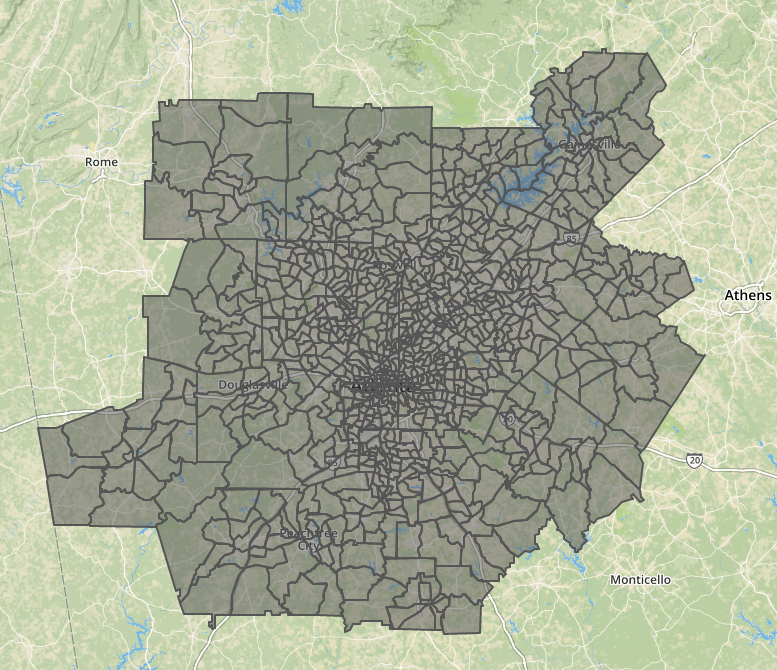
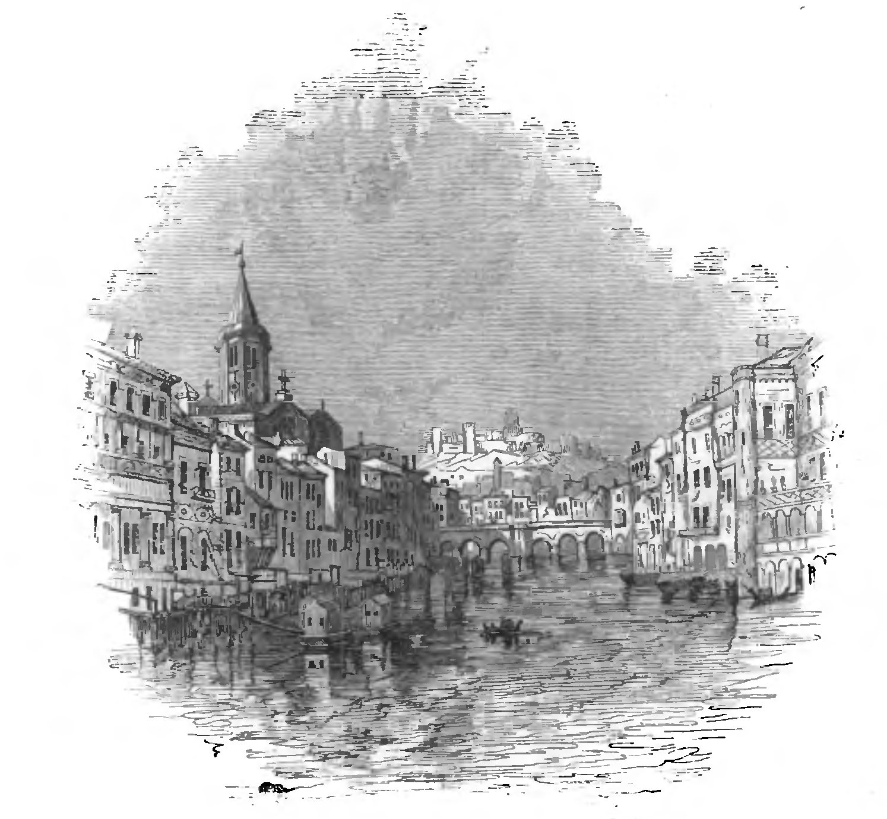

# Design Lab: Arrange Map or Network Data

**Work in pairs, with someone who is not in your project group.**

In this design lab, you will choose **one** of the two possible tasks listed below. You are going to follow  the [five design sheet process](http://fds.design/) that we are using for Milestone 3 on the group project, with some minor differences.

1. You will work independently on the first sheet (brainstorming).
2. You will work together as a group on the remaining sheets.
3. Your group will collect and post your resulting sheets 2, 3, 4, and 5 to Slack under in_class_exercises. 

Your [brainstorming page](http://fds.design/index.php/2015/06/25/sheet-1-brain-storm/) should make it clear that you explored the design space available for analyzing the dataset. You should follow the process for filtering, categorizing, and combining the many possible small ideas so that you hone in on the best possible solution.

Your [initial design page](http://fds.design/index.php/2015/06/25/sheet-2-3-4-initial-designs/) should include visualization(s) that would allow a user to explore the dataset. These should be more complex than a single bar chart, line graph, or pie chart. In this lab, the "what" is decided for you, but it is up to you to decide the "why" and "how." Make certain that both are clear, and follow the design guidelines and rules of thumb that we have emphasized in this course.

## 1. Arrange Spatial Data
You will design a visualization for a geospatial dataset. 

It is not a requirement that you propose a map-based visualization method. While there are many good map-based options for spatial data, there are also many good visualization methods that treat these items more like tabular data. There are trade-offs for either approach, depending on what you think is important to investigate about this data.

### Dataset: Atlanta Metro Commute Data

You have a few options here for looking at the data. You DO NOT have to look at all three, the same attributes are present in each, they are being provided to make it more convenient for you to open them in different applications without trying to convert them yourself.
- Included in this repo is a tabular csv with the data attributes organized by region. This would be the easiest file to load into a spreadsheet application or into a tabular vis in d3.
- Also included is a geojson file. The geojson file also has all of the same attributes, but they are nested within the shape for each region so that you could load this into a spatial data visualization or online geojson browser (e.g., http://geojson.io).
- Finally, I have included the more traditional shapefile zip that you would use if you wanted to load this into a more feature-rich GIS system (e.g., ArcGIS).

Description from the [Atlanta Regional Commission](https://opendata.atlantaregional.com/datasets/GARC::commuting-2016/about):

> Shows the method of transportation, in numbers and percentages, that workers use to get to work and their mean travel time, by census tract in the Atlanta region.

A comprehensive description of the individual attributes and an interactive map-based data browser can also be found on the link above.

**Important:** Before you ask, no, I do not expect you to sketch designs that include *all* of the individual regions. There are 948 of them! Your designs should just convey what sort of marks and channels would be used to represent the data in enough detail to get the idea across, but this should not be a finished product depicting all of the regions.

## 2. Arrange Network Data

You will design a visualization for a character network dataset from Romeo and Juliet in co-occurrence form. 

It is not a requirement that you propose a network-based visualization method. While there are many good options for network data, there are also many good visualization methods that treat these items more like tabular data. There are tradeoffs for either approach, depending on what you think is important to investigate about this data.

### Dataset: Romeo and Juliet [rj.xlsx]

The workbook contains two sheets: Co-occurrence and Scenes. In the Co-occurrence sheet, you will find a co-occurrence network of all the major characters in William Shakespeare's *Romeo and Juliet*. This data is stored as an adjacency matrix. Each time any two characters are in the same scene of the play, the link increases in magnitude by one. The identity link (e.g., RO x RO = 13) indicates the total scenes each character appears in. The second sheet, Scenes, provides the full information for which characters appear in the scenes of the play. The scenes are organized by Act. The second sheet is also a key to the abbreviations used in the first sheet (e.g., RO = "Romeo, son to Montague").

You may use either sheet, or both, to design your visualization. If you are familiar with the story, you are encouraged to use your knowledge of the material towards improving the effectiveness of your design. If you are not familiar with the story, many summaries are available online and the full text is available on [Project Gutenberg](https://www.gutenberg.org/ebooks/1112). You can also find additional data, including a list of lines for each character, at [Open Source Shakespeare](https://www.opensourceshakespeare.org/views/plays/playmenu.php?WorkID=romeojuliet) if you want to enhance the visualization further.

## Deadline
Your pdf upload (one per pair) to Slack should be posted before the end of the day to the in_class_exercises channel. Try to finish up before class ends -- this isn't intended to be more than an in-class activity! Look at what others designed and give feedback in the respective threads. This will be good practice for the poster session for Milestone 3. 
